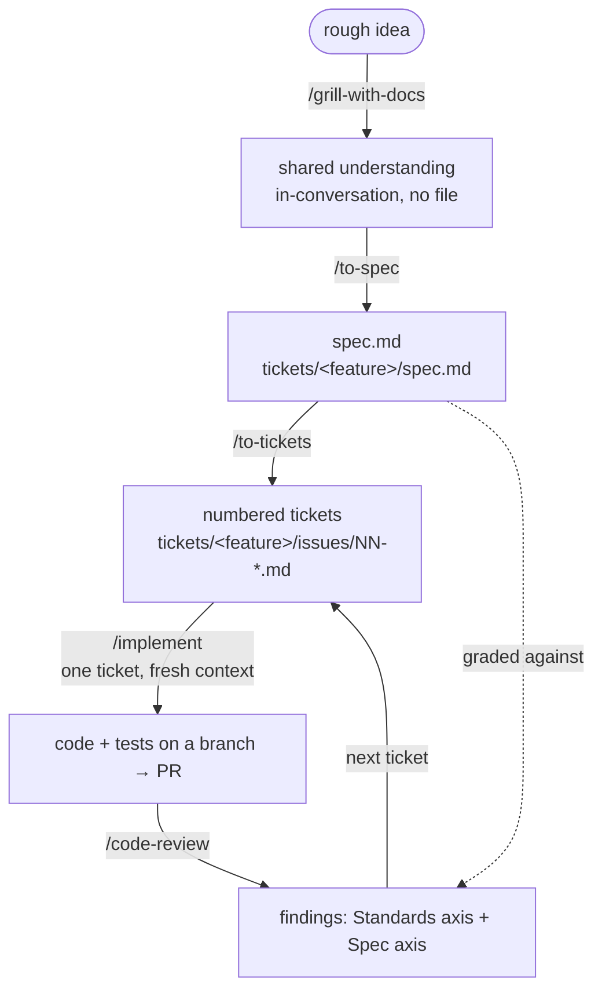

# The development loop (Matt Pocock skills flow)

Our feature workflow is a chain of agent skills that **narrow** from a fuzzy
idea to graded code:

`/grill-with-docs` → `/to-spec` → `/to-tickets` → `/implement` → `/code-review`

Each step feeds the next. The spec is referenced twice — once to _generate_
tickets, once to _grade_ the implementation — which is why it's worth writing
carefully.



## The five steps

| Step               | Does                                                                                                                                                                                                                 | Consumes                  | Creates                            | Context              |
| ------------------ | -------------------------------------------------------------------------------------------------------------------------------------------------------------------------------------------------------------------- | ------------------------- | ---------------------------------- | -------------------- |
| `/grill-with-docs` | Interrogates the idea — reads `CONTEXT.md`, `PRD.md`, HLD/LLD, ADRs first, then grills the _gaps_                                                                                                                    | your intent + domain docs | understanding, in chat only        | one unbroken window, |
| `/to-spec`         | Freezes the grilling into a contract: problem, stories, implementation + testing decisions, out-of-scope, traps                                                                                                      | the grilling              | `tickets/<feature>/spec.md`        | shared across        |
| `/to-tickets`      | Slices the spec into vertical tracer-bullet tickets (schema → API → tests for one demoable behaviour), with `Blocked by` edges                                                                                       | `spec.md`                 | `tickets/<feature>/issues/NN-*.md` | these three          |
| `/implement`       | Builds one ticket: dispatches an implementer subagent with ticket + spec, TDD at agreed seams, typecheck/tests as it goes                                                                                            | one ticket (+ spec)       | code + tests on a branch → PR      | fresh per ticket     |
| `/code-review`     | Grades the diff on two independent axes run as parallel subagents — **Standards** (repo conventions, code smells) and **Spec** (missing requirements, scope creep) — reported separately so one can't mask the other | diff + spec + standards   | findings, split by axis            | with the diff        |

**Why the first three share one window:** the grilling lives in chat, not a file. A
`/clear` between grill and spec loses the nuance that only exists there.

**Why `/implement` starts fresh:** a ticket is self-contained by construction, so it
needs only the spec + itself — not the noise of earlier tickets. The context hook
(`AGENTS.md` → _Who does the work_) enforces the boundary.

## Skills — which toolkit does which job

Two toolkits are on this machine and both could run a feature end to end. We use
**one spine and borrow three skills**, so there is exactly one way to write a spec.

| Job                                 | Skill                                                                   | From                     |
| ----------------------------------- | ----------------------------------------------------------------------- | ------------------------ |
| Understand the idea                 | `/grill-with-docs`                                                      | mattpocock/skills        |
| Freeze it into a spec               | `/to-spec` → `tickets/<feature>/spec.md`                                | mattpocock/skills        |
| Slice into tickets                  | `/to-tickets` → `tickets/<feature>/issues/NN-*.md`                      | mattpocock/skills        |
| Build one ticket                    | `/implement`, dispatching via `superpowers:subagent-driven-development` | mattpocock + superpowers |
| Prove it works before claiming done | `superpowers:verification-before-completion`                            | superpowers              |
| Review the diff                     | `/code-review` (standards axis + spec axis)                             | mattpocock/skills        |
| Keep it lean                        | `ponytail` (always on), `/ponytail-review` at self-check                | ponytail                 |
| Merge, clean up, close out          | `superpowers:finishing-a-development-branch`                            | superpowers              |
| Try it as a stranger                | `/naive-test` (once there is a UI)                                      | naive-user plugin        |
| Record a decision / a term          | `/domain-modeling` → `CONTEXT.md`, `docs/adr/`                          | mattpocock/skills        |

**Why Matt Pocock as the spine:** tickets are files. One ticket = one subagent dispatch =
one unit the tracker, the triage labels, and the worktree rule all agree on.
**Why borrow from superpowers:** it has the stronger start and finish —
`subagent-driven-development`, `verification-before-completion`, and
`finishing-a-development-branch` have no Matt Pocock equivalent.
**Not used:** superpowers' `brainstorming` / `writing-plans` spec-and-plan flow — a
second way to write a spec — and its `executing-plans`. If you reach for one of those,
stop and use the row above instead.

Installation: `npx skills add mattpocock/skills` after scaffold (lockfile
`skills-lock.json`); `superpowers` and `ponytail` are
user-level plugins; `naive-user` is installed once there is a UI.

**Repo-local skills to add once code exists** (`.claude/skills/`, modelled on techgarden):

- `running-the-app` — how to start the app locally, seed data, reset; used by `/run`
  and the naive-user agent.
- `reconciling-status` — the checklist the self-check runs: which of `hld.md`, `lld.md`,
  `PRD.md`, `docs/status.md`, `CONTEXT.md` a change touches, and what "reconciled" means.

## Planned: `/develop` — one command that runs the loop

Modelled on techgarden's `.claude/commands/develop.md`, at roughly a quarter of the
size. **Written after the first feature ships through the manual flow above**, so it
encodes what actually happened rather than what we imagined (see `PLAN.md` Phase 1).
Until then, the five skills are run by hand in the order shown.

### Shape

`/develop <feature>` runs, in one session:

1. `/grill-with-docs` → `/to-spec`. **Spec audit**: before the spec is shown, a
   context-blind subagent reads it adversarially (holes, contradictions, untestable
   lines); fixes land first. → **Gate 1** — approve the spec.
2. `/to-tickets`. → **Gate 2** — approve the tickets.
3. **Hand off.** Gate 2 approval is the trigger, no exceptions. Your answers and any
   "approve, but…" condition are **appended to `spec.md` before** the handoff prompt is
   emitted — the fresh session inherits the file, never the chat. The prompt is
   ready-to-paste: `/develop --resume <feature>`.

`/develop --resume <feature>` (fresh session; also auto-detected when
`tickets/<feature>/issues/` has unfinished tickets):

4. For each ticket in dependency order: dispatch **one implementer subagent** with the
   ticket + `spec.md` (see `AGENTS.md` → _Who does the work_). Anything the implementer
   discovers that must hold ("X must never happen") is appended to `spec.md` under
   `## Discovered`, not left in its report. **Triggered reviewer**: a ticket that touches
   auth, tenancy, migrations, or CI gets a second-opinion review subagent automatically.
5. **Self-check** before the PR: `/ponytail-review`,
   `superpowers:verification-before-completion`, and **reconcile the living docs** —
   `docs/design/hld.md` / `lld.md` if a table, route, flow, or component changed;
   `PRD.md` if what v1 _is_ changed; `docs/status.md` if anything real changed.
6. Open the PR. **Validate loop**: `/code-review` → fix → re-review, at most **2**
   rounds. Anything still open goes to Gate 3 as _needs waiver_, never a third round.
   **Naive-user run** (once there is a UI): the naive-user agent opens the running app
   and tries the feature as a stranger, scoped to what this PR changed; findings go to
   `qa/naive-user/`, blockers to Gate 3. → **Gate 3** — merge or iterate.
7. **Close-out** after the merge decision: squash-merge, delete the branch, update
   `docs/status.md`, one message saying where things stand.

### Gate messages

Every message that stops the loop for your decision — Gate 1, Gate 2, Gate 3, and the
close-out — uses this form. Everything else uses the short rule in `AGENTS.md`
(recommend → needs your decision → decided without asking → stop).

```
**<The ask — one sentence naming the decision.>**

**What this is**
<The work in plain language, assuming the reader has lost all context. As long as it
needs to be. Explain any term not seen this session, or cut it.>

**What happened**
<At most two sentences: the outcome of this round, not an inventory.
"Audit raised 6 findings, 1 blocker; all fixed, nothing needs you. Detail: <path>">

**Needs your decision** — <one line per choice, with the recommended option; or "nothing">

**Decided without asking**
- <one line each; only what an ADR, the repo, or a measurement already settles. Omit if empty.>

**What happens next**
<The next one or two steps. At Gate 2 this holds the paste-ready prompt for the fresh session.>

**To review:** <path> · <what it carries> · ~<n> min
```

Rules: _What this is_ and _What happens next_ are never omitted. No two bullets in a
section start with the same two words. Close-out replaces the ask with "where things
stand" and drops _To review_. Nothing follows the last line.

### Fast lane

A bugfix, or a change that copies an existing shape, skips steps 1–3. The agent
announces _"fast lane: mirrors `<reference>`, delta is `<what changes>`"_; you can veto
the classification there. The PR description is the spec; steps 4–7 run as normal.

### Worktree per thing

Every new piece of work — feature, fix, chore — gets its own git worktree under
`.worktrees/`, one folder per branch. The main checkout stays on `main` and is never
worked in directly. Plain git, no tool-specific step, so any agent or human follows it:

```sh
git fetch origin                                            # fresh base — never branch off stale local main
git worktree add --no-track -b feature/<slug> .worktrees/feature-<slug> origin/main
cd .worktrees/feature-<slug> && npm install                 # node_modules are per-worktree
# ...work, commit...
git push -u origin feature/<slug>                           # first push sets the upstream
# after merge:
git worktree remove .worktrees/feature-<slug> && git branch -d feature/<slug>
```

`--no-track` stops a later bare `git push` from landing on `origin/main` under a
non-default `push.default`. `git worktree list` shows everything in flight. Agents that
have a native worktree tool may use it, but the folder and branch name must match the
above so the result is indistinguishable.

### Deliberately left out

Model tiering (one model for everything), token receipts ledger, harness-outage
playbook. Each is a fix for a problem
this project hasn't hit; add it when it does.
